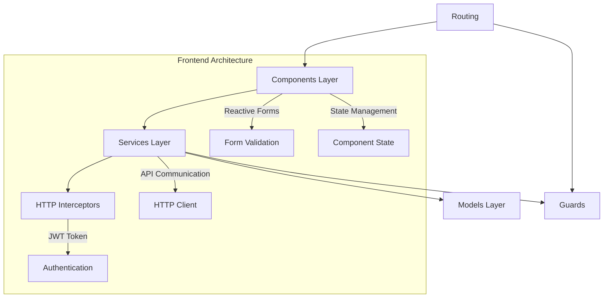

# 🏦 Sistema de Gestión de Créditos - Frontend

<div align="center">


**Frontend de aplicación de gestión de créditos en línea para prueba técnica del Banco de Guayaquil**

[Demo](#) | [Backend API](https://github.com/Dafesanc/AppCreditosBackEnd) | [Documentación](https://drive.google.com/drive/u/1/folders/1ntHn_5vnf6bDgPQHv8mUmPP78LCLK1p2)

</div>

---

## 📋 Tabla de Contenidos

- [🚀 Instalación y Configuración](#-instalación-y-configuración)
- [🏗️ Arquitectura de Implementación](#️-arquitectura-de-implementación)
- [🧠 Lógica de Desarrollo](#-lógica-de-desarrollo)
- [⚡ Funcionalidades del Sistema](#-funcionalidades-del-sistema)
- [✨ Buenas Prácticas Aplicadas](#-buenas-prácticas-aplicadas)
- [🛠️ Tecnologías Utilizadas](#️-tecnologías-utilizadas)
- [📁 Estructura del Proyecto](#-estructura-del-proyecto)

---

## 🚀 Instalación y Configuración

### 📋 Prerrequisitos

Asegúrate de tener instaladas las siguientes herramientas:

```bash
# Node.js (versión 18 o superior)
node --version
# npm (versión 9 o superior)
npm --version
# Angular CLI (versión 19 o superior)
ng version
```

### 🔧 Pasos de Instalación

1. **Clonar el repositorio:**
   ```bash
   git clone <URL_DEL_REPOSITORIO>
   cd AppCreditos/FrontEnd/AppCreditosFrontEnd
   ```

2. **Navegar al directorio del proyecto Angular:**
   ```bash
   cd CreditsApp
   ```

3. **Instalar dependencias:**
   ```bash
   npm install
   ```

4. **Configurar el entorno:**
   - Verificar la URL del backend en `src/app/settings/appsettings.ts`
   ```typescript
   export const appsettings = {
     apiUrl: 'https://localhost:7068/api' // Ajustar según tu backend
   }
   ```
   IMPORTANTE VERIFICAR AL LEVANTAR EN LOCAL QUE URL TIENE TU BACKEND Y CONFIGURARLA EN ESTE ARCHIVO TAL COMO ESTA EL EJEMPLO EN EL COMO YO LO HICE

5. **Ejecutar la aplicación:**
   ```bash
   npm start
   # o
   ng serve
   ```

6. **Acceder a la aplicación:**
   - Abrir navegador en: `http://localhost:4200`

### 📦 Dependencias Principales

| Dependencia | Versión | Propósito |
|-------------|---------|-----------|
| `@angular/core` | ^19.2.0 | Framework principal |
| `@angular/forms` | ^19.2.0 | Formularios reactivos |
| `@angular/router` | ^19.2.0 | Navegación y rutas |
| `tailwindcss` | ^4.1.9 | Framework CSS |
| `jwt-decode` | ^4.0.0 | Decodificación de tokens JWT |
| `rxjs` | ~7.8.0 | Programación reactiva |

---

## 🏗️ Arquitectura de Implementación

### 🎯 Patrón de Arquitectura



### 🔧 Capas de la Aplicación

#### 1. **Capa de Presentación (Components)**
- **Componentes principales:** Login, Register, Home, Credits Management
- **Componentes compartidos:** Header, Footer
- **Componentes de modales:** View Application Details

#### 2. **Capa de Servicios (Services)**
- **AuthService:** Gestión de autenticación y autorización
- **CreditsApplicationService:** Operaciones CRUD de solicitudes
- **UsersService:** Gestión de usuarios
- **AuditLogsService:** Registro de auditoría

#### 3. **Capa de Datos (Models)**
- **Interfaces TypeScript** para tipado fuerte
- **Modelos de dominio:** User, CreditApplication, AuditLog

#### 4. **Capa de Seguridad**
- **Guards:** Protección de rutas por roles
- **Interceptors:** Manejo automático de tokens JWT

---

## 🧠 Lógica de Desarrollo

### 🔐 Sistema de Autenticación

```typescript
// Flujo de autenticación JWT
Login → Validate Credentials → Generate JWT → Store Token → Redirect
```

**Características:**
- Token JWT con expiración automática
- Refresh token para renovación
- Roles de usuario: `Applicant` y `Analyst`
- Guards para protección de rutas

### 🎭 Control de Acceso por Roles

| Rol | Permisos | Vistas Disponibles |
|-----|----------|-------------------|
| **Applicant** | Crear y ver sus solicitudes | Formulario de solicitud, Historial personal |
| **Analyst** | Ver y gestionar todas las solicitudes | Dashboard analítico, Modal de aprobación/rechazo |

### 🔄 Gestión de Estado

- **Reactive Forms** para manejo de formularios
- **Observables (RxJS)** para comunicación asíncrona
- **Local Storage** para persistencia de sesión

---

## ⚡ Funcionalidades del Sistema

### 👤 Para Solicitantes (Applicants)

<details>
<summary><b>🎯 Gestión de Solicitudes</b></summary>

- ✅ **Crear nueva solicitud de crédito**
  - Formulario con validaciones en tiempo real
  - Campos: Monto, Plazo, Ingreso mensual, Experiencia laboral
  
- ✅ **Visualizar historial personal**
  - Tabla responsiva con estado de solicitudes
  - Formato de montos con decimales precisos
  
- ✅ **Estados de seguimiento**
  - Pendiente, Aprobado, Rechazado
  - Indicadores visuales con códigos de color

</details>

### 🔍 Para Analistas (Analysts)

<details>
<summary><b>📊 Dashboard de Gestión</b></summary>

- ✅ **Vista completa de solicitudes**
  - DataGrid con todas las solicitudes del sistema
  - Información del solicitante y detalles financieros
  
- ✅ **Sistema de filtros**
  - Filtro por estado de solicitud
  - Búsqueda y ordenamiento dinámico
  
- ✅ **Modal de detalle y gestión**
  - Vista completa de información del solicitante
  - Sugerencia automática del sistema
  - Botones de aprobación/rechazo
  
- ✅ **Evaluación automática**
  - Algoritmo de sugerencia basado en criterios financieros
  - Recomendación visual para toma de decisiones

</details>

### 🎨 Características de UI/UX

- **Diseño responsivo** con Tailwind CSS
- **Dark theme** profesional
- **Animaciones suaves** y transiciones
- **Feedback visual** para acciones del usuario
- **Loading states** para mejor experiencia

---

## ✨ Buenas Prácticas Aplicadas

### 🏗️ Arquitectura y Código

<details>
<summary><b>📁 Organización de Código</b></summary>

```
src/
├── app/
│   ├── components/           # Componentes reutilizables
│   ├── pages/               # Páginas principales
│   ├── services/            # Lógica de negocio
│   ├── guards/              # Protección de rutas
│   ├── interceptors/        # Manejo de HTTP
│   ├── models/              # Interfaces y tipos
│   └── settings/            # Configuraciones
```

</details>

### 🔒 Seguridad

- ✅ **Autenticación JWT** con tokens seguros
- ✅ **Guards de ruta** para control de acceso
- ✅ **Interceptors** para manejo automático de tokens
- ✅ **Validación de roles** en frontend y backend
- ✅ **Sanitización de inputs** y validaciones

### 📝 Calidad de Código

- ✅ **TypeScript strict mode** para tipado fuerte
- ✅ **Interfaces bien definidas** para todos los modelos
- ✅ **Componentes modulares** y reutilizables
- ✅ **Separación de responsabilidades** por capas
- ✅ **Manejo de errores** centralizado

### 🎯 Performance

- ✅ **Lazy loading** de módulos
- ✅ **OnPush change detection** strategy
- ✅ **Optimización de imágenes** y assets
- ✅ **Tree shaking** para bundle optimization
- ✅ **Reactive programming** con RxJS

### 🧪 Testing (Preparado)

- ✅ **Estructura de testing** configurada
- ✅ **Unit tests** con Jasmine/Karma
- ✅ **Mocks de servicios** preparados

---

## 🛠️ Tecnologías Utilizadas

### Frontend Stack

| Tecnología | Versión | Propósito |
|------------|---------|-----------|
| **Angular** | 19.2.0 | Framework SPA |
| **TypeScript** | 5.7.2 | Lenguaje tipado |
| **TailwindCSS** | 4.1.9 | Framework CSS |
| **RxJS** | 7.8.0 | Programación reactiva |
| **JWT Decode** | 4.0.0 | Manejo de tokens |

### Herramientas de Desarrollo

- **Angular CLI** - Tooling y scaffolding
- **PostCSS** - Procesamiento de CSS
- **Karma/Jasmine** - Testing framework
- **TypeScript Compiler** - Transpilación

---

## 📁 Estructura del Proyecto

```
CreditsApp/
├── 📁 src/
│   ├── 📁 app/
│   │   ├── 📁 components/         # Componentes principales
│   │   │   ├── 📄 credits-application/
│   │   │   └── 📄 view-application/
│   │   ├── 📁 Pages/             # Páginas de navegación
│   │   │   ├── 📄 home/
│   │   │   ├── 📄 login/
│   │   │   ├── 📄 register/
│   │   │   └── 📄 user/
│   │   ├── 📁 services/          # Servicios de negocio
│   │   │   ├── 📄 auth/
│   │   │   ├── 📄 creditsApplication/
│   │   │   ├── 📄 users/
│   │   │   └── 📄 audits/
│   │   ├── 📁 guards/            # Protección de rutas
│   │   ├── 📁 interceptors/      # HTTP interceptors
│   │   ├── 📁 shared/            # Componentes compartidos
│   │   │   ├── 📄 header/
│   │   │   └── 📄 footer/
│   │   └── 📁 Models/            # Interfaces TypeScript
│   ├── 📁 assets/                # Recursos estáticos
│   ├── 📁 environments/          # Configuraciones de entorno
│   └── 📄 styles.css            # Estilos globales
├── 📄 package.json              # Dependencias del proyecto
├── 📄 angular.json              # Configuración Angular
├── 📄 tailwind.config.js        # Configuración Tailwind
└── 📄 tsconfig.json             # Configuración TypeScript
```

---

<div align="center">

### 🚀 ¡Aplicación lista para producción!

**Desarrollado con ❤️ por Daniel Sanchez usando Angular 19 + TailwindCSS**

---

*Para soporte técnico o consultas, contactame por correo o a mi número personal.*

</div>
